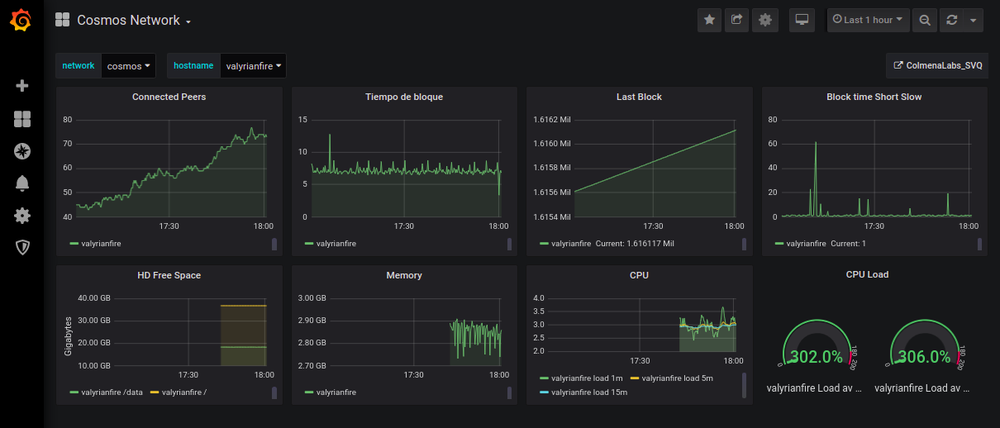

<h1 align="center">Dasboard de Grafana para Cosmos</h1>

 

Puedes encontrar información para los <a href="https://github.com/Colm3na/Cosmos-Validators/tree/wimelTesting/delegadores">delegadores</a> y los <a href="https://github.com/Colm3na/Cosmos-Validators/tree/wimelTesting/validadores"> validadores.</a>

Recuerda que si tienes alguna duda siempre puedes venir a la <a href="https://www.coworkingcolmena.com">Colmena</a> para resolverla juntos.

